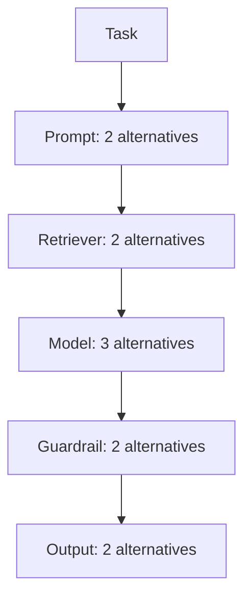

# Mycelial Graph V0

Local adaptation and structural reuse in dynamic AI execution graphs.

**Author:** Crizan Belém Ribeiro  
**Affiliation:** Independent Researcher, São Paulo, Brazil  
**Status:** V0 executable demonstrator - not a scientific result

## The idea in one minute

An AI request rarely uses only one model. It may cross a prompt strategy, retriever, model, guardrail, and output formatter. Each stage can have alternatives, so the number of complete routes grows quickly. Prices, latency, quality, load, and availability can also change while the system is running.

Mycelial Graph asks a narrow, falsifiable question: **when a change damages only one part of this graph, can local edge adaptation preserve useful knowledge about the parts that still work?**

V0 turns that question into runnable software. Every directed edge stores a conductance. A traversed edge is reinforced or attenuated from local observations; inactive state decays; routing uses a temperature-controlled softmax; and a small, separately logged exploration probability keeps alternatives reachable. Hard security and policy constraints are applied before any soft score.

## What you can demonstrate today

The included simulation builds this graph:



That creates 48 complete execution paths. The runner pre-generates all outcomes, executes a localized shock against `model_balanced`, gives each method feedback only for its traversed edges, and produces:

- a human-readable Markdown report;
- machine-readable JSON results;
- compressed immutable trials with SHA-256 hashes;
- trace samples before and after the shock;
- recovery, censoring, CPST, SER, success, utility, time, and operation metrics.

## Five-minute run

Requirements: Python 3.11 or newer.

```bash
python -m venv .venv
source .venv/bin/activate          # Windows PowerShell: .venv\Scripts\Activate.ps1
python -m pip install -e .
mycelial-graph demo
```

Open:

```text
outputs/demo/REPORT.md
outputs/demo/results.json
```

Run the configured 12-seed comparison:

```bash
mycelial-graph experiment --output outputs/v0_results
```

Run the invariant and integration tests:

```bash
python -m unittest discover -s tests -v
```

Run without installation:

```bash
PYTHONPATH=src python -m mycelial_graph demo
```

## Commands

| Command | Purpose |
| --- | --- |
| `mycelial-graph demo` | One-seed walkthrough with report generation |
| `mycelial-graph experiment` | Configured multi-seed V0 comparison |
| `mycelial-graph freeze --seed 101` | Pre-generate and hash one immutable trial |

Use `--config`, `--output`, or `--seeds 101,211` to override paths or the seed set. The generated output always includes the exact frozen configuration used.

## Scope freeze

V0 contains only:

1. per-edge conductance;
2. lazy temporal decay;
3. strictly local feedback;
4. probabilistic local routing;
5. explicit basal exploration;
6. a hard constraint boundary outside soft rewards.

V0 intentionally excludes reinforcement learning, graph neural networks, predictive failure models, federated learning, production-provider integrations, and architecture recommendations. Those additions are deferred until the frozen hypotheses justify more complexity.

## Scientific honesty

This repository proves that the experimental loop is implementable and auditable. It does **not** prove that Mycelial Graph is better than structured bandits or dynamic shortest-path methods. H1, H2, and H3 require a larger frozen benchmark, disjoint tuning and evaluation seeds, strong verified baselines, causal shared-structure manipulation, ablations, and censoring-aware statistics.

The checked-in report in `outputs/v0_results/REPORT.md` contains observations from the V0 run. It must not be presented as a paper result.

## Documentation map

| Reader | Start here |
| --- | --- |
| Non-technical stakeholder | [Plain-language overview](docs/OVERVIEW.md) |
| Engineer applying the POC | [Quickstart and operations](docs/QUICKSTART.md) |
| Architect or researcher | [Architecture](docs/ARCHITECTURE.md) |
| Specification reviewer | [Specification alignment](docs/SPECIFICATION_ALIGNMENT.md) |
| Reviewer or experiment owner | [Experimental protocol](docs/EXPERIMENT_PROTOCOL.md) |
| Hyperparameter reviewer | [Development tuning note](docs/DEVELOPMENT_TUNING.md) |
| Results reader | [Results guide](docs/RESULTS_GUIDE.md) |
| Cloud validation team | [Single-cloud validation plan](docs/CLOUD_VALIDATION.md) |
| Security or governance reviewer | [Security boundary](docs/SECURITY.md) |
| Roadmap owner | [Evidence-gated roadmap](docs/ROADMAP.md) |
| Any reader | [Glossary](docs/GLOSSARY.md) |

## Repository layout

```text
configs/                  Frozen V0 YAML
docs/                     Audience-layered documentation
src/mycelial_graph/       Executable package
tests/                    Unit and integration tests
outputs/v0_results/       Reproducible V0 report and trial artifacts
```

## License

MIT License. Research claims and authorship are not transferred by the software license.
