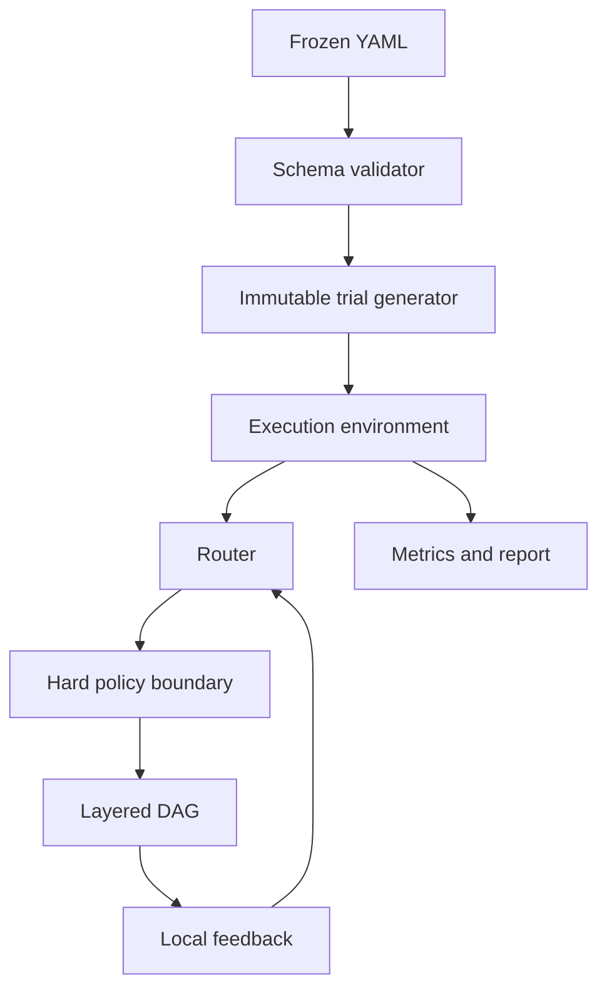

# Architecture

## System boundary



The environment owns outcomes. A router owns routing state. The hard-policy boundary removes prohibited edges before the router sees candidates. Metrics consume the resulting trace but cannot influence the current run.

## Module map

| Module | Responsibility |
| --- | --- |
| `config.py` | Load YAML and enforce the frozen V0 contract |
| `graph.py` | Build and validate the typed layered DAG; enforce hard constraints |
| `trial.py` | Pre-generate local potential outcomes and compute a trial digest |
| `routing.py` | Mycelial V0 and two transparent reference policies |
| `experiment.py` | Execute identical trials, compute recovery and operational metrics |
| `report.py` | Produce a dual-audience Markdown report |
| `cli.py` | Expose `demo`, `experiment`, and `freeze` commands |

## Frozen Mycelial state

Every edge `e` stores:

- conductance `g_e`;
- time of last decay;
- time of last use;
- time of last feedback.

The timestamps are separate so candidate evaluation, actual traversal, and feedback cannot be conflated.

For elapsed time `delta`, lazy decay is:

```text
g_e <- max(g_min, g_e * (1 - lambda)^delta)
```

After traversed-edge feedback:

```text
g_e <- clip(g_e + eta * local_reward + xi * explored, g_min, g_max)
```

The normalized local reward is:

```text
alpha_q * quality
- alpha_l * normalized_latency
- alpha_c * normalized_cost
- alpha_f * failure
- alpha_rho * load
```

Weights are configuration values and must be frozen before evaluation.

Every V0 path contains the same number of scored components, so common path utility is the mean of these edge-local utilities. This preserves the ranking of their additive sum and avoids judging a local router against a differently shaped objective. Task success and CPST remain end-to-end measures.

## Route selection

At a node with multiple feasible outgoing edges:

```text
P(e | u) = exp(g_e / temperature) / sum_j exp(g_j / temperature)
```

With probability `p_expl`, the router instead samples uniformly and labels the choice `explicit-exploration`. A single feasible edge uses `single-edge-fallback`. These modes are logged separately.

For a selected path of length `L_P` and mean visited out-degree `d_P`, Mycelial selection examines `O(L_P * d_P)` edges, performs `O(L_P)` feedback updates, and stores `O(|E|)` state. The implementation reports primitive operations separately from task latency.

## Fairness and information flow

For every seed, the environment generates one local observation for every `(step, edge)` pair before a comparison. A method sees only observations for its chosen path. Therefore:

- noise is paired across methods;
- future outcomes are unavailable to routers;
- changing post-shock severity does not change pre-shock observations;
- all policy decisions can be reproduced from seed, configuration, and code.

## Reference baselines

`StructuredSemiBanditRouter` stores edge-level sample means and uses an upper-confidence score during local traversal. `ReactiveShortestPathRouter` stores exponentially weighted edge utilities and selects the best currently estimated complete path. Both are intentionally small, inspectable V0 comparators. Final research claims require verified, independently reviewed baseline implementations and computational accounting.

## Hard constraints

`HardPolicy` blocks configured components and components whose declared cost exceeds a hard cap. Filtering occurs before Mycelial conductance, UCB, or path estimates are evaluated. If a layer has no feasible option, execution fails closed with `NoFeasiblePathError`.
