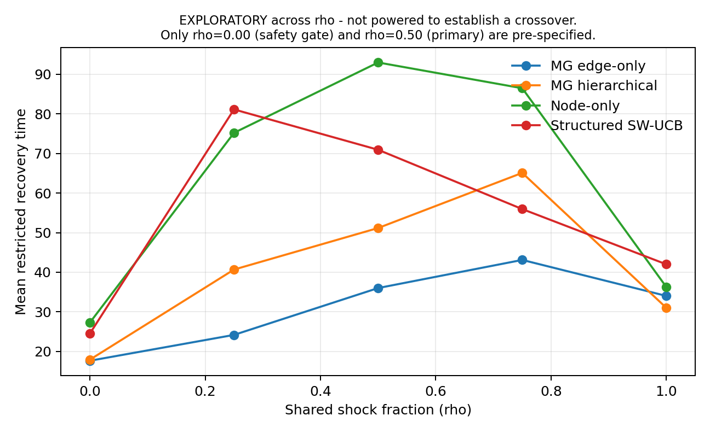
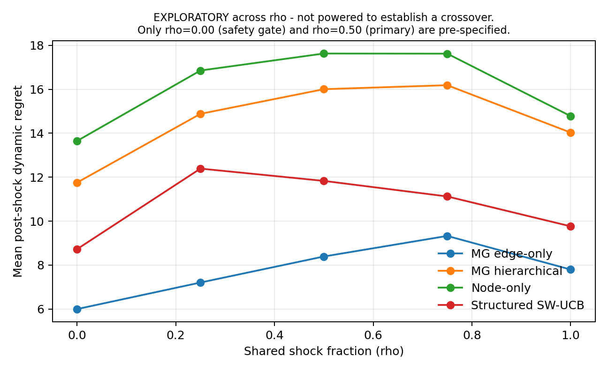

# Mycelial Graph V1 - Experiment Report

**Protocol:** `MG-EXP-V1`  
**Experiment:** `MG-EXP-V1-CONFIRMATORY`  
**Run kind:** `confirmatory`  
**Result state:** `REFUTED`

> This is a confirmatory execution governed by MG-EXP-V1.

## Result state

**`REFUTED`** - safety gate at rho=0 is `NEGATIVE_TRANSFER_NOT_EXCLUDED`.

- one-sided upper bound +0.7214 is not below zero and the interval lower bound +0.1190 excludes the pre-specified relevant benefit -0.20

`SUPPORTED`, `CONDITIONAL`, `INCONCLUSIVE`, `REFUTED`, and `PROTOCOL_INVALID` are all legitimate terminal states of the frozen protocol. The mapping is fixed in `experiments/v1/HYPOTHESIS_MATRIX.md` and was pre-specified before any confirmatory outcome was observed.

## Primary confirmatory contrast (CONFIRMATORY)

At rho=0.50, the estimated relative difference in mean restricted recovery time for hierarchical versus edge-only was **42.1%** (bootstrap 11.899% to 79.088%; one-sided upper bound 72.138%; 97 paired scenarios).
Negative values mean faster hierarchical recovery; positive values mean slower hierarchical recovery.

## Safety gate at rho=0 (SAFETY GATE)

Relative difference **1.5%**, one-sided upper bound 16.309% against the frozen non-inferiority margin 10.0%. Gate result: `NEGATIVE_TRANSFER_NOT_EXCLUDED`.

## Decision gate

| Requirement | Role | Result |
|---|---|---:|
| Statistical superiority at rho=0.50 | PRIMARY | False |
| Estimated engineering gain <= -0.20 | SECONDARY | False |
| Non-inferiority at rho=0 | SAFETY GATE | False |
| Promote hierarchical state (requirements 1-3) | ENGINEERING | False |

Automated coverage: protocol section 8.2 requirements 1-3. protocol section 8.2 requirement 4 is not automated: no cost budget is frozen, so product promotion additionally requires a separate operational-cost decision

## Integrity

- Censoring administrative only: True
- Trials censored without reaching tau: 0
- Method failures inside a frozen contrast: 0

## Group metrics

Rows marked `EXPLORATORY`, `DIAGNOSTIC`, or `SECONDARY` carry no error control and cannot support an inferential claim.

| rho | Method | Role | Trials | Mean RRT | Recovery | Dynamic regret | Final expected utility | CPU mean / p95 (s) |
|---:|---|---|---:|---:|---:|---:|---:|---:|
| 0.00 | MG edge-only | CONFIRMATORY INPUT | 97 | 17.649 | 100.0% | 6.001 | 0.626 | 0.043 / 0.047 |
| 0.00 | MG hierarchical | CONFIRMATORY INPUT | 97 | 17.918 | 100.0% | 11.755 | 0.603 | 0.054 / 0.062 |
| 0.00 | Node-only | SECONDARY | 97 | 27.278 | 100.0% | 13.648 | 0.599 | 0.049 / 0.062 |
| 0.00 | Structured SW-UCB | SECONDARY | 97 | 24.515 | 96.9% | 8.727 | 0.615 | 0.680 / 0.766 |
| 0.25 | MG edge-only | EXPLORATORY | 97 | 24.175 | 100.0% | 7.208 | 0.622 | 0.044 / 0.062 |
| 0.25 | MG hierarchical | EXPLORATORY | 97 | 40.680 | 100.0% | 14.881 | 0.591 | 0.056 / 0.078 |
| 0.25 | Node-only | EXPLORATORY | 97 | 75.216 | 97.9% | 16.852 | 0.584 | 0.053 / 0.078 |
| 0.25 | Structured SW-UCB | EXPLORATORY | 97 | 81.134 | 77.3% | 12.390 | 0.598 | 0.673 / 0.781 |
| 0.50 | MG edge-only | CONFIRMATORY INPUT | 97 | 36.010 | 100.0% | 8.393 | 0.620 | 0.045 / 0.062 |
| 0.50 | MG hierarchical | CONFIRMATORY INPUT | 97 | 51.175 | 99.0% | 16.002 | 0.585 | 0.058 / 0.078 |
| 0.50 | Node-only | SECONDARY | 97 | 92.990 | 96.9% | 17.624 | 0.580 | 0.053 / 0.078 |
| 0.50 | Structured SW-UCB | SECONDARY | 97 | 70.938 | 82.5% | 11.831 | 0.602 | 0.711 / 0.800 |
| 0.75 | MG edge-only | EXPLORATORY | 97 | 43.113 | 100.0% | 9.329 | 0.620 | 0.053 / 0.081 |
| 0.75 | MG hierarchical | EXPLORATORY | 97 | 65.103 | 96.9% | 16.184 | 0.583 | 0.067 / 0.109 |
| 0.75 | Node-only | EXPLORATORY | 97 | 86.485 | 92.8% | 17.618 | 0.583 | 0.065 / 0.094 |
| 0.75 | Structured SW-UCB | EXPLORATORY | 97 | 55.959 | 92.8% | 11.124 | 0.610 | 0.845 / 1.128 |
| 1.00 | MG edge-only | DIAGNOSTIC | 97 | 34.021 | 100.0% | 7.799 | 0.624 | 0.047 / 0.062 |
| 1.00 | MG hierarchical | DIAGNOSTIC | 97 | 31.000 | 100.0% | 14.029 | 0.597 | 0.060 / 0.078 |
| 1.00 | Node-only | DIAGNOSTIC | 97 | 36.258 | 100.0% | 14.779 | 0.593 | 0.055 / 0.078 |
| 1.00 | Structured SW-UCB | DIAGNOSTIC | 97 | 42.000 | 92.8% | 9.765 | 0.614 | 0.799 / 0.897 |

## Figures (EXPLORATORY across rho)

These curves span the whole rho grid. They are exploratory: this design is not powered to establish a crossover, and no rho* may be read off them.

## Interpretation boundary

- The experiment isolates representation under an identical local-feedback contract.
- The structured SW-UCB baseline uses node-edge features and therefore does not give MG a representation monopoly.
- The oracle defines expected optimal utility; it is not a deployable competitor.
- Development and pilot executions are for debugging and sample-size planning only.
- A failed gate is not evidence for the absence of all effects; interpretation follows the frozen analysis plan.
- The frozen sample size is powered for the rho=0.50 primary contrast only. It does not make any other contrast adequately powered.
- This evidence is synthetic. It does not extend to real providers, deployment, or any causal mechanism.
- Reproduction here is internal and automated, never independent.

## Reproducibility

Raw paired trials are under `raw/`, processed statistics under `processed/`, traces under `traces/`, and file hashes plus runtime versions are recorded in `manifest.json`.
