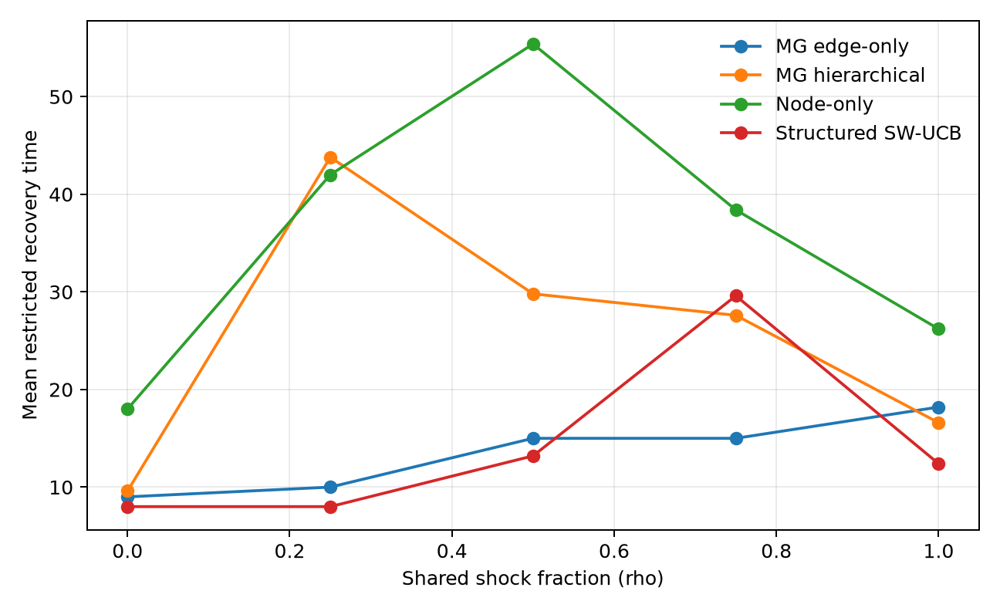
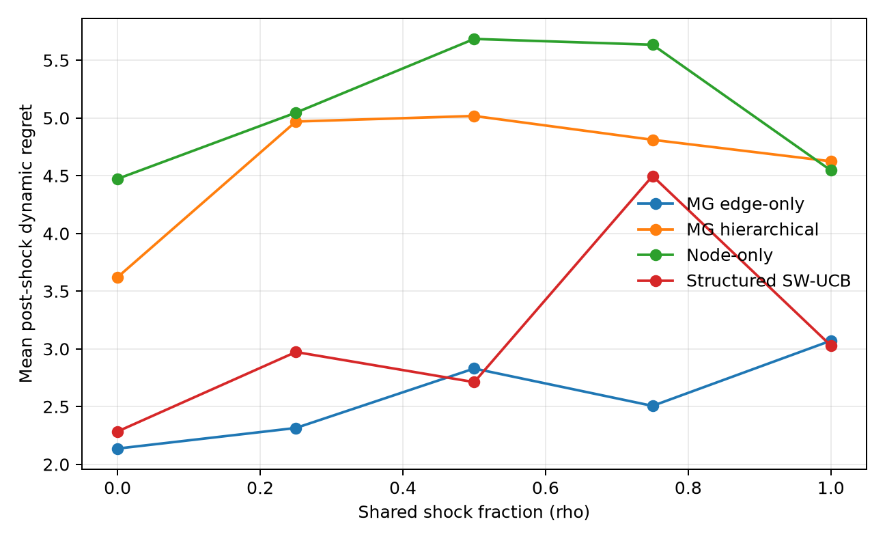

# Mycelial Graph V1 - Experiment Report

**Protocol:** `MG-EXP-V1`  
**Experiment:** `MG-EXP-V1-DEVELOPMENT`  
**Run kind:** `development`

> This is a development/pilot execution. It must not be presented as confirmatory evidence.

## Executive result

At rho=0.50, the estimated relative difference in mean restricted recovery time for hierarchical versus edge-only was **98.7%** (bootstrap 1.653% to 250.000%; one-sided upper bound 225.096%).
Negative values mean faster hierarchical recovery; positive values mean slower hierarchical recovery.

The promotion gate is **NOT PASSED**. This decision is meaningful only for a confirmatory run.

## Decision gate

| Requirement | Result |
|---|---:|
| Statistical superiority | False |
| Estimated engineering gain | False |
| Non-inferiority at rho=0 | False |
| Promote hierarchical state | False |

## Group metrics

| rho | Method | Trials | Mean RRT | Recovery | Dynamic regret | Final expected utility | CPU mean / p95 (s) |
|---:|---|---:|---:|---:|---:|---:|---:|
| 0.00 | MG edge-only | 5 | 9.000 | 100.0% | 2.137 | 0.629 | 0.006 / 0.016 |
| 0.00 | MG hierarchical | 5 | 9.600 | 100.0% | 3.621 | 0.604 | 0.013 / 0.016 |
| 0.00 | Node-only | 5 | 18.000 | 100.0% | 4.473 | 0.604 | 0.016 / 0.016 |
| 0.00 | Structured SW-UCB | 5 | 8.000 | 100.0% | 2.285 | 0.614 | 0.128 / 0.153 |
| 0.25 | MG edge-only | 5 | 10.000 | 100.0% | 2.315 | 0.617 | 0.016 / 0.016 |
| 0.25 | MG hierarchical | 5 | 43.800 | 100.0% | 4.969 | 0.585 | 0.009 / 0.028 |
| 0.25 | Node-only | 5 | 42.000 | 100.0% | 5.046 | 0.592 | 0.013 / 0.028 |
| 0.25 | Structured SW-UCB | 5 | 8.000 | 100.0% | 2.973 | 0.601 | 0.119 / 0.138 |
| 0.50 | MG edge-only | 5 | 15.000 | 100.0% | 2.830 | 0.622 | 0.009 / 0.016 |
| 0.50 | MG hierarchical | 5 | 29.800 | 100.0% | 5.018 | 0.586 | 0.019 / 0.028 |
| 0.50 | Node-only | 5 | 55.400 | 80.0% | 5.685 | 0.584 | 0.009 / 0.016 |
| 0.50 | Structured SW-UCB | 5 | 13.200 | 100.0% | 2.712 | 0.610 | 0.119 / 0.125 |
| 0.75 | MG edge-only | 5 | 15.000 | 100.0% | 2.506 | 0.619 | 0.019 / 0.028 |
| 0.75 | MG hierarchical | 5 | 27.600 | 100.0% | 4.811 | 0.584 | 0.016 / 0.016 |
| 0.75 | Node-only | 5 | 38.400 | 80.0% | 5.635 | 0.573 | 0.013 / 0.016 |
| 0.75 | Structured SW-UCB | 5 | 29.600 | 80.0% | 4.498 | 0.595 | 0.113 / 0.159 |
| 1.00 | MG edge-only | 5 | 18.200 | 100.0% | 3.071 | 0.616 | 0.016 / 0.016 |
| 1.00 | MG hierarchical | 5 | 16.600 | 100.0% | 4.625 | 0.581 | 0.016 / 0.028 |
| 1.00 | Node-only | 5 | 26.200 | 100.0% | 4.546 | 0.596 | 0.009 / 0.016 |
| 1.00 | Structured SW-UCB | 5 | 12.400 | 100.0% | 3.029 | 0.611 | 0.122 / 0.138 |

## Figures

## Interpretation boundary

- The experiment isolates representation under an identical local-feedback contract.
- The structured SW-UCB baseline uses node-edge features and therefore does not give MG a representation monopoly.
- The oracle defines expected optimal utility; it is not a deployable competitor.
- Development and pilot executions are for debugging and sample-size planning only.
- A failed gate does not prove absence of all effects; interpretation follows the frozen analysis plan.

## Reproducibility

Raw paired trials are under `raw/`, processed statistics under `processed/`, traces under `traces/`, and file hashes plus runtime versions are recorded in `manifest.json`.
